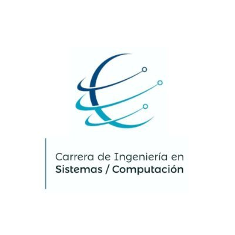

# Prototipo de juego serio para la prevención temprana de la violencia sexual infantil en estudiantes de primer grado de la escuela municipal Dr. Ángel Felicísimo Rojas

 
## TABLA DE CONTENIDOS
1. [Autores]
1. [Descripción y contexto]
1. [Guía de Usuario]
1. [Guía de Configuracion del Servidor Web]

## Autores
El presente Trabajo de Titulación fue desarrollado por:

    Kevin Jeison Cumbicus Solano - kevin.cumbicus@unl.edu.ec
    Byron Alexander Herrera Martinez - byron.herrera@unl.edu.ec

Con la dirección del:

    Ing. José Oswaldo Guamán Quinche, Mg.Sc. - jose.o.guaman@unl.edu.ec

## Descripción y contexto

El presente repositorio contiene la documentación y código fuente del proyecto de titulación denominado **Prototipo de juego serio para la prevención temprana de la violencia sexual infantil en estudiantes de primer grado de la escuela municipal Dr. Ángel Felicísimo Rojas** el cual consiste en una aplicación móvil para dispositivos tablet con sistema android junto a una plataforma de administración web multiplataformas que tiene como objetivo la detección y prevención temprana de violencia sexual infantil en estudiantes de primer grado. 

Las funcionalidades con las que cuenta el prototipo de juego serio son:

**-Plataforma de administración**
* Gestión de Usuarios
* Gestión de Instituciones
* Gestión de Estudiantes
* Gestión de Docentes
* Gestión de DECE
* Gestión de Test Estudiante
* Gestión de Test Docente
* Gestión de Casos
* Evaluación de Casos

**-Aplicativo Móvil**
* Gestión de Actividades realizadas en la aplicación móvil por los niños.

## Guía de Usuario

Para ingresar al prototipo de juego serio de software solicitar la dirección url al correo: direccion.cis@unl.edu.ec o su vez al autor..

https://drive.google.com/drive/folders/1XwkDg1afR8SPP7HppD8mP_H0mzHXNztu?usp=sharing

## Guía de Configuracion del Servidor Web

https://drive.google.com/drive/folders/1ZaLV2rX-5iyWNU8-H7mtG6-CMeuGk28L?usp=sharing

Las Tecnologías y Herramientas utilizadas fueron:

* Motor de Videojuegos Unity - Version del Editor 2021.3.14f1
* Lenguaje de Programación APP Móvil C#
* Frontend desarrollado con Angular versión 15.2.9
* Banckend desarrollado con Nodejs versión 18.17.1 y ExpressJs versión 4.18.2
* Lenguaje de Programación APP Web JavaScript y TypeScript.
* Gestor de Base de Datos MongoDb

## Enlace al repositorio Git del juego serio desarrollado en Unity

https://github.com/Computacion-UNL/juegoseriovl_backend.git

